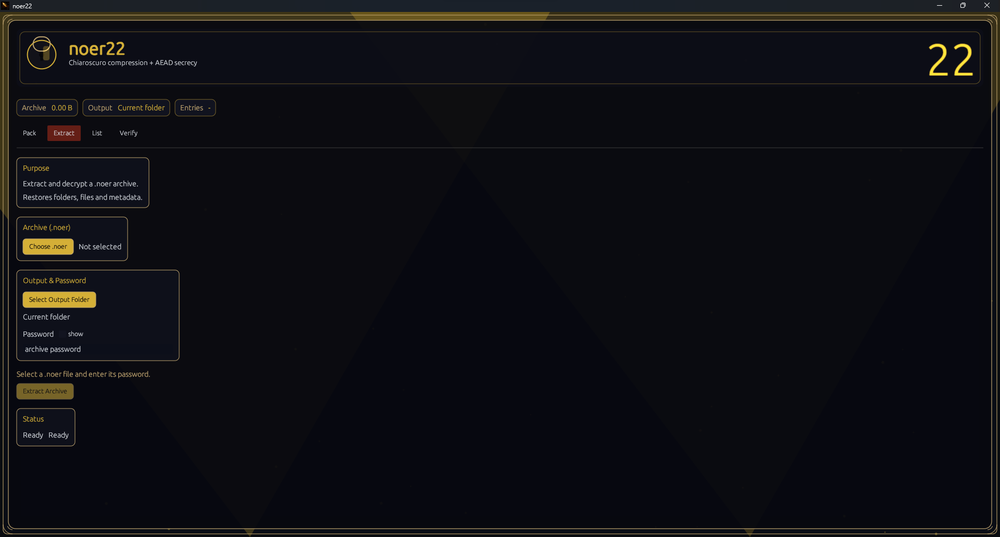
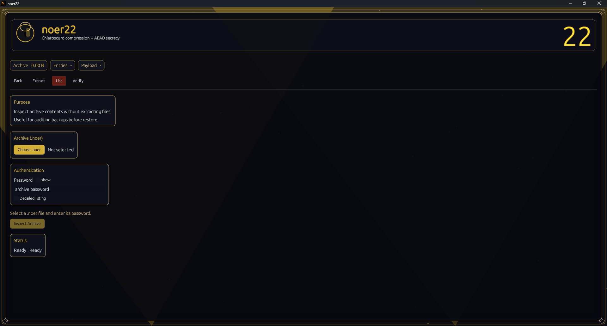
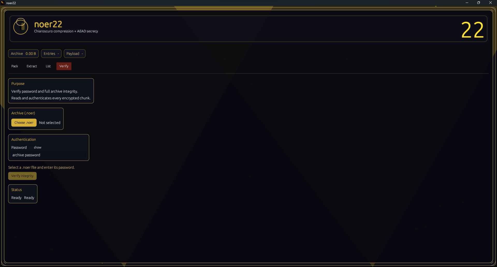

# noer22

`noer22` is a Rust archive tool that packs files/folders into a single `.noer` file with:
- Zstd compression
- AEAD encryption (ChaCha20-Poly1305 or AES-256-GCM)
- Argon2id key derivation

## Quick Start (CLI)

```bash
noer22 pack <input...> -o <output.noer> -p <password> [-l <level>] [--cipher chacha|aes]
noer22 unpack <archive.noer> -p <password> [-C <dir>]
noer22 list <archive.noer> -p <password> [--long]
noer22 verify <archive.noer> -p <password>
noer22 wizard
```

## Examples

```bash
noer22 pack ./folder -o backup.noer -p "my_password" -l 10
noer22 pack file1.txt file2.bin -o files.noer -p "secret" --cipher aes
noer22 unpack backup.noer -p "my_password" -C ./out
noer22 list backup.noer -p "my_password" --long
noer22 verify backup.noer -p "my_password"
```

## Desktop GUI (optional)

Run the desktop app:

```bash
cargo run --release --features gui --bin noer22_gui
```

GUI modes:
- `Pack`: build encrypted archives
- `Extract`: unpack encrypted archives
- `List`: inspect archive contents without extraction
- `Verify`: validate full archive integrity

## Showcase (template)

Short product-style description:
- **Pack** archives with compression + encryption in one flow.
- **Extract** safely with metadata-aware restoration.
- **List** archive contents before extraction.
- **Verify** full archive integrity end-to-end.

Add your screenshots to these paths:
- `assets/screenshots/gui-pack.png`
- `assets/screenshots/gui-extract.png`
- `assets/screenshots/gui-list.png`
- `assets/screenshots/gui-verify.png`

README image blocks (ready to use):

```md

*Pack mode: select inputs, output, cipher, and KDF settings.*


*Extract mode: restore archive content to a chosen folder.*


*List mode: inspect entries and metadata without extracting files.*


*Verify mode: validate password and full archive integrity.*
```

## Release Assets

- Changelog: `CHANGELOG.md`
- GitHub release notes draft: `RELEASE_NOTES.md`

## `.noer` Format (summary)

- Header (64 bytes)
  - Magic: `NOER22\0\0`
  - Version: `1`
  - Compression: `0 = zstd`
  - Crypto: `0 = ChaCha20-Poly1305`, `1 = AES-256-GCM`
  - Salt (16 bytes)
  - Nonce base (12 bytes)
  - Argon2id params (`mem_kib`, `iters`, `parallelism`)

- Encrypted metadata (chunk 0)
  - Entries with relative path, size, timestamp, mode and directory flag
  - Serialized with `postcard`

- Compressed + encrypted payload (sequential chunks)
  - Single zstd stream for all file data
  - Each chunk has authenticated tag and `u32` length prefix

## Notes

- All content is authenticated. Any tampering fails decryption.
- Streaming design supports large files.
- Empty directories are preserved, including input root directories.

## Development

```bash
cargo build --release
cargo build --release --features gui --bin noer22_gui
cargo test
cargo clippy --all-targets --all-features -- -D warnings
```

## License

This project uses a **custom personal-use-only license**.

Commercial use, resale, monetized redistribution, and monetized forks are not allowed without prior written authorization.
See `LICENSE` for full terms.

If you find improvements (features, performance, security, UX), please contact the author via repository issues/profile before publishing derivative distributions.
